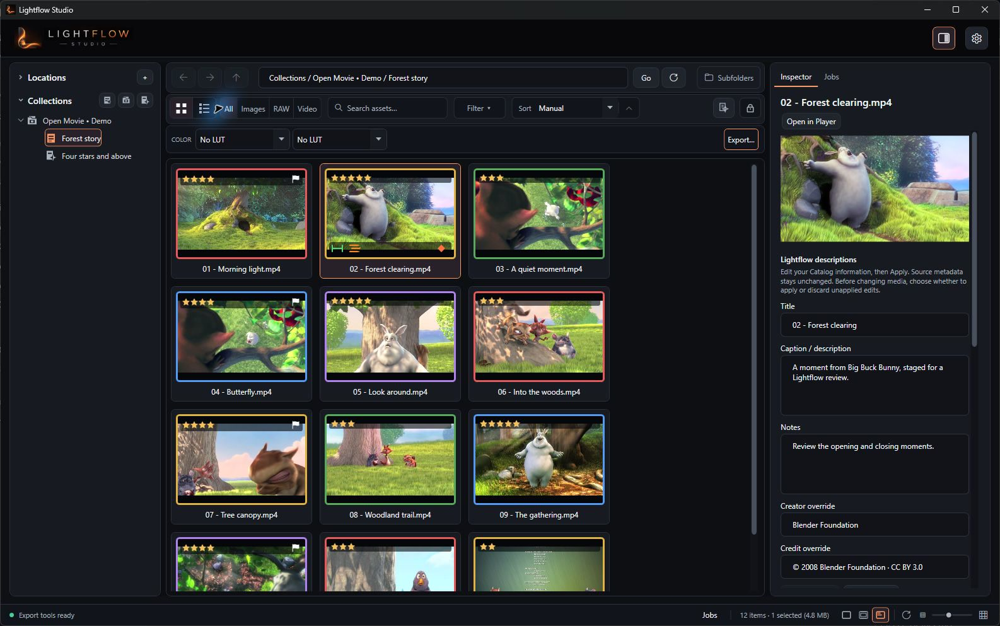
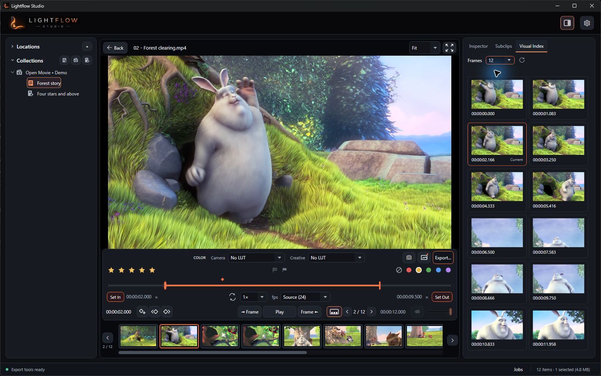

# Lightflow Studio

**Browse your media. Find the moments. Take them further.**

Lightflow Studio is a native Windows media workbench for photographers and videographers.
Move from real folders to a focused review, organize your selects, try Color looks, and
turn useful moments into Subclips, exports, or a Premiere Pro handoff. Your review work
stays with the media in Lightflow's Catalog, ready for the next session.

Current version: **0.40.0** · [Download the latest Windows release](https://github.com/jeremyrunningphotography/lightflow-studio/releases/latest)

This README describes current `main`. The latest published release may contain an earlier
set of features; see its release notes before downloading.

## Browse your folders


The Browser starts with the folders you already use. Navigate local drives, removable storage, and
mapped or network locations with familiar Back, Forward, Up, and Refresh controls.
Include subfolders when a shoot spans several directories, then narrow the view with
filename/path search, media types, ratings, flags, labels, and available metadata filters.

- **Choose the view that fits the task.** Use Preview, Info, or Hybrid tiles for visual
  browsing, or switch to Details for sortable rows and configurable columns.
- **Inspect and describe.** The shared Right Panel follows your Browser selection or
  Player media. Inspector shows technical metadata and lets you save titles,
  descriptions, notes, creator, and credit in the Catalog, including edits to a selection.

Cut, copy, paste, move, rename, create folders, and reveal items in Windows Explorer
without leaving the browsing workflow. Ordinary Delete uses the Recycle Bin where
available; permanent deletion requires an explicit decision. Larger file operations
appear in Jobs so you can keep working.

### Organize across folders



When you want to gather related media across folders, create a **Collection** without
moving the files. **Collection Sets** organize those Collections. **Smart Collections**
save rules against a chosen folder or Collection and update their matches as you work.
Your filesystem remains the foundation; Collections give you another way to organize
and revisit the same media.

## Review the moments that matter


Open media from the Browser and review the current results or a selected subset through
the Player filmstrip. Video controls include frame stepping, playback speed, looping,
volume, zoom, and a separate Frame Rate Preview for judging lower delivery cadence.
Rate, label, flag, and add timeline markers while you review.

Save an In/Out range for a video, or keep several named **Subclips** from the same source.
Subclips are reusable Catalog ranges, not duplicate source files. Non-destructive video
rotation corrects presentation in the Player and Previews and carries into encoded exports.
You can also choose a paused frame as the Browser Preview or save a full-resolution screengrab.

### Jump through a video with Visual Index



Visual Index gives you a grid of sampled frames: choose a timestamp to jump to that
point in the video. It reflects the video's Color and rotation choices. Open it in the
Player's Right Panel, or prepare indexes for selected videos from the Browser as
background Jobs.

### Evaluate Color before exporting

Apply a **Camera LUT**, a **Creative LUT**, or both, in that order. Configure your own
`.cube` libraries in Settings, assign looks in the Browser or Player, and compare them
during playback. Color-aware Previews help you recognize the look across the Browser,
Subclips, and Visual Index. Assignments remain in the Catalog; they do not rewrite originals.

## Export and keep working


Export selected videos directly from the Browser or the current Player video. When the
Browser selection includes saved Subclips, its Export menu also offers a Subclip export:
saved Subclips become individual outputs, while selected videos without Subclips are
included in full. Review the proposed files before starting.

Choose a destination folder or export beside each original, optionally into a subfolder.
Preview output names, choose whole videos or saved In/Out ranges, and keep per-video
Camera/Creative Color or override it for the export. Source-aware settings preserve
chosen source characteristics while re-encoding; explicit format, resolution, frame rate,
quality, and audio controls are available when delivery needs differ.

Video encoding uses NVIDIA NVENC H.264 or HEVC, including Apple-compatible `hvc1` HEVC
in MP4. A supported NVIDIA GPU and driver are required for these encoders; Lightflow
checks actual encoder readiness before export.

Each output runs as an independent Job with its chosen settings. Check activity in the
Browser's compact Jobs panel, or open the full **Jobs** workspace to search current and
saved work, inspect results, control the queue and active-job limit, and use the retry
or Review & Rerun actions available for that kind of work. Pausing the queue lets running
work finish while holding new starts. Removing finished Job records does not delete media.

## Continue in Premiere Pro

Send selected source videos or saved Subclips to a bin in the active Premiere project.
Videos can carry saved source In/Out points; Subclips become native Premiere subclips.
Lightflow point markers accompany the handoff, with markers inside each Subclip mapped
to its local timing. Results appear in Jobs. This is an explicit handoff: later changes
are not continuously synchronized, and Color/LUT choices and Catalog rotation are not
transferred as Premiere effects.

**Premiere Pro 26.5 or later and the Lightflow Studio Companion are required.**
Current `main` bundles companion **1.2.2**; install the companion supplied with your
Lightflow build rather than relying on an older installed copy.

1. Open **Settings → General → Premiere Pro Integration** and install the bundled
   companion CCX through Creative Cloud Desktop.
2. Open **Window → UXP Plugins → Lightflow Studio Companion** in Premiere. For the
   initial connection, use **Copy Setup Location** in Lightflow's first-time setup,
   then **Allow Connection Access** in the companion and select that folder.
3. Keep the companion panel open and a Premiere project available. In Lightflow,
   choose **Send To → Premiere Pro**, review Videos or Subclips, and select a destination
   bin. Save the Premiere project after handoff.

After a companion update, restart Premiere so it loads the new version, then refresh
installation status in Lightflow. Installed/Ready and Connected are different states;
the Send dialog must have a live connection and valid project destination before sending.
See [Premiere setup and handoff details](docs/premiere-companion.md).

## Pick up where you left off

Lightflow restores your Browser scope, filters, selection, layout, and supported Player
review state, reopening video paused. The **Catalog** holds durable work such as ratings,
descriptions, Color assignments, rotation, markers, ranges, Subclips, and Collections.
**Previews** hold rebuildable thumbnails and derived data separately.

Settings groups everyday preferences under General, Color, Storage, and Advanced:
capture location, LUT libraries, Catalog backup/recovery, Preview location and quota,
and processing dependency checks. Export settings live with Export. Media and Catalog
work stay local; Premiere handoff and file operations happen only when you choose them.

## Install and run

Download the installer or portable ZIP from the
[latest Windows release](https://github.com/jeremyrunningphotography/lightflow-studio/releases/latest).
Lightflow targets 64-bit Windows 10 and Windows 11.

Packages are self-contained and include verified, pinned processing and playback
dependencies. You do not need to install .NET or FFmpeg separately. NVIDIA hardware is
required for NVENC export, not for organizing your Catalog.

The installer requests UAC elevation and installs per-machine under `Program Files`
by default. The portable ZIP runs without installer registration; it still uses local
user-data locations and does not make the Catalog portable or shared between computers.

## Build from source

The desktop application uses C#, .NET 8, and WPF. On Windows, install the .NET 8 SDK:

```powershell
winget install Microsoft.DotNet.SDK.8
```

From the repository root:

```powershell
dotnet build .\LightflowStudio\LightflowStudio.csproj -c Release
dotnet test .\LightflowStudio.Tests\LightflowStudio.Tests.csproj
```

For a self-contained package with verified dependencies and startup checks:

```powershell
powershell.exe -NoProfile -ExecutionPolicy Bypass -File .\scripts\Build-Release.ps1 -Mode PullRequest -SkipInstaller
& ".\artifacts\release\LightflowStudio\LightflowStudio.exe" --data-root "$PWD\.cache\development-profile"
```

Use a task-owned `--data-root` when testing experimental builds. See
[development data profiles](docs/development-data-profiles.md).

For processing tools in a development build, Lightflow checks the FFmpeg location saved
in Settings, then `ffmpeg\bin\ffmpeg.exe` beside the application, then Windows `PATH`.
The package script supplies the pinned FFmpeg/FFprobe tools and the separate playback
libraries. A complete installer build also requires
[Inno Setup 6](https://jrsoftware.org/isdl.php).

## Safety and diagnostics

- Catalog review edits do not rewrite original media. Explicit file operations can
  move, rename, or delete files. Premiere may write media metadata or sidecars according
  to its own behavior and preferences.
- Export validates destinations and collisions. Active outputs use a `.lightflow`
  partial filename; the final filename is created or replaced only after processing
  succeeds and the result is validated. Overwrite is an explicit export choice.
- Settings, workspace state, and logs normally live under
  `%LOCALAPPDATA%\Jeremy Running Photography\Lightflow Studio`; Catalog and Preview
  storage can be managed separately in Settings.
- The rotating `activity.log` records dependency checks, processing commands, results,
  and errors. Review logs for private paths before sharing them.
- Dependency versions, licenses, and source/build records are documented in
  [third-party notices](THIRD-PARTY-NOTICES.md),
  [processing FFmpeg](dependencies/ffmpeg.json), and
  [playback dependencies](dependencies/flyleaf.json).

## Project documentation

- [Documentation index](docs/README.md)
- [Product vision](docs/PRODUCT_VISION.md)
- [Architecture](docs/ARCHITECTURE.md)
- [UI guidelines](docs/UI_GUIDELINES.md)
- [Roadmap](docs/ROADMAP.md)
- [Release planning](docs/RELEASE_PLAN.md)

Normal development targets `main`; released minor families use maintenance branches
such as `release/0.40`. Release preparation uses `set-version.ps1` and
`scripts/Build-Release.ps1`. Validated `vX.Y.Z` tags publish the installer, portable ZIP,
and SHA-256 checksums. See release planning for exact-source validation and publication gates.

Screenshot media: *Big Buck Bunny*, © 2008 Blender Foundation / www.bigbuckbunny.org,
[CC BY 3.0](https://creativecommons.org/licenses/by/3.0/).
[Source and screenshot notes](docs/assets/readme/README.md).
