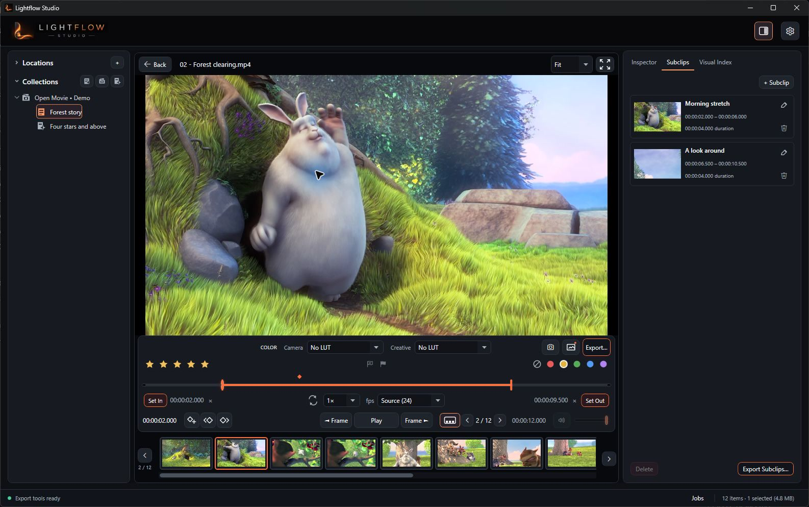
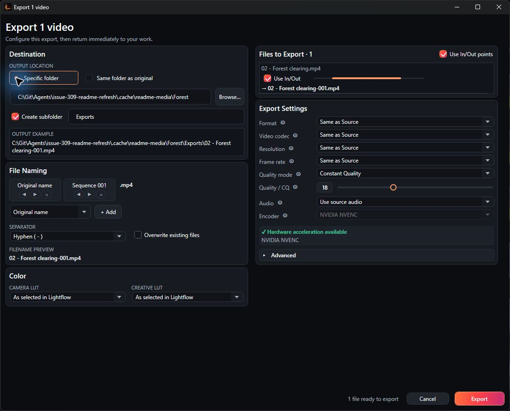
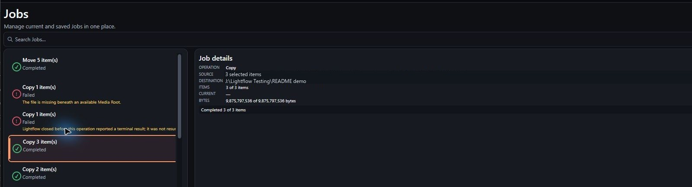

# Lightflow Studio

**A native Windows media workbench for photographers and videographers.**

Lightflow Studio brings browsing, review, color, Subclips, export, background Jobs,
and practical file operations into one calm desktop workflow. It is built for people
who need to move quickly through large folders without opening a full editing suite—or
giving up control over their originals.

Current version: **0.39.0** · [Download the latest Windows release](https://github.com/jeremyrunningphotography/lightflow-studio/releases/latest)


The Browser is Lightflow's home. Browse real folders or Collections, search and filter
media, change thumbnail density, and see useful Catalog state directly on each asset.
The view above combines star ratings, color labels, picks, working ranges, saved
Subclips, and applied Color state without hiding the media itself.

## Browse, review, act

### Organize media without losing context

- Browse folders and managed Media Roots with Back, Forward, Up, Refresh, and optional
  subfolder inclusion.
- Organize assets into Collections and Collection Sets without changing the filesystem.
- Filter by media type, search, sort, and switch between clean Preview, detailed Info,
  and compact Hybrid thumbnail presentations.
- Use Explorer-style Cut, Copy, Paste, Move, Rename, New Folder, and safe Delete. Moves
  preserve Lightflow identity; copies become independent Catalog assets; ordinary Delete
  uses the Windows Recycle Bin.
- Let larger or uncertain filesystem operations promote automatically into background
  Jobs while small operations stay immediate.

### Review footage and shape useful ranges



Open an asset directly from the Browser to review it in the Player. Frame stepping,
playback, a precise timeline, In/Out points, ratings, labels, and picks keep review work
close to the image. Camera and Creative LUT stages can be evaluated together, while
durable Subclips turn useful ranges into named, reusable Catalog objects that can be
reviewed or exported independently.

### Configure an export, then get back to work



The focused Export dialog makes output intent explicit before work enters the queue:

- export to one specific folder or beside each original;
- add an optional subfolder in either destination mode;
- build deterministic filenames and detect collisions before execution;
- export whole assets or current In/Out ranges;
- preserve per-asset Camera and Creative Color choices;
- choose source-aware or explicit format, codec, resolution, frame rate, quality, and
  audio settings, with advanced controls available when needed.

Each file becomes an independent immutable Job, so mixed batches retain their resolved
source settings and destinations even after the Export window closes. Lightflow supports
NVIDIA NVENC H.264 and HEVC—including Apple-compatible `hvc1` HEVC in MP4—at source or
delivery resolutions from 480p through 4K UHD.

### Track background work in one Jobs experience



The compact Jobs drawer follows Browser and Player work; the full Jobs workspace brings
current and saved Jobs together for search, inspection, queue control, retry, and
Review & Rerun. Details remain capability-aware: exports retain media settings and output
provenance, while filesystem Jobs report their operation, source summary, destination,
item progress, byte progress, failures, and final result.

## More tools for real media folders

Lightflow also includes:

- asynchronous media details for resolution, frame rate, duration, size, codec, and
  audio, plus warning badges for outliers;
- configurable `.cube` Camera and Creative LUT libraries;
- FFmpeg/FFprobe and NVIDIA encoder readiness checks;
- full decode verification with CSV reporting;
- lossless MP4 rewrapping, 1080p editing proxies, and contact sheets;
- Normal, salvage-audio-and-video, and video-only recovery modes;
- persistent activity logging and safe `.lightflow` partial outputs;
- named encoding presets with recommended defaults and advanced overrides;
- an experimental Premiere Pro V1 timeline clip exporter.

Lightflow is local-first: media stays on your computer unless an explicit future
publishing capability says otherwise. The Catalog stores durable user work such as
ratings, labels, Color assignments, ranges, Collections, and Subclips; rebuildable
Previews remain separate.

## Install and run

Lightflow Studio supports 64-bit Windows 10 and Windows 11. Download the installer or
portable ZIP from the [latest release](https://github.com/jeremyrunningphotography/lightflow-studio/releases/latest).

Release packages are self-contained and include a pinned, verified FFmpeg/FFprobe build.
You do not need to install .NET, the .NET SDK, or FFmpeg separately. NVENC export requires
a supported NVIDIA GPU and current NVIDIA driver; the Browser, Catalog, Player, and other
non-encoding workflows do not require the .NET SDK.

The installer is per-machine, requests normal UAC elevation, and installs under
`Program Files` by default. Catalogs, Previews, settings, Jobs/History records, logs, and
other mutable data remain in Lightflow's user-data locations. The portable package is
independent of installer registration.

## Build from source

The desktop application is written in C# on .NET 8 and WPF.

Install the .NET 8 SDK:

```powershell
winget install Microsoft.DotNet.SDK.8
```

From the repository root:

```powershell
powershell.exe -ExecutionPolicy Bypass -File .\build.ps1
dotnet test .\LightflowStudio.Tests\LightflowStudio.Tests.csproj
```

For development builds, Lightflow searches for FFmpeg in this order:

1. The location selected in **Settings**
2. `ffmpeg\bin\ffmpeg.exe` beside the application
3. Windows `PATH`

Install a development FFmpeg build with Windows Package Manager if needed:

```powershell
winget install Gyan.FFmpeg
ffmpeg -version
ffmpeg -hide_banner -encoders | Select-String "h264_nvenc|hevc_nvenc"
```

Alternatively, place the tools beside a published development build:

```text
LightflowStudio.exe
ffmpeg\
  bin\
    ffmpeg.exe
    ffprobe.exe
```

## Encoding presets and recovery

Lightflow ships with four starting presets:

- **Recommended:** H.264 NVENC, P7, constant quality 18, full-resolution multipass,
  adaptive quantization, and source audio copy.
- **Maximum Quality:** 10-bit HEVC, constant quality 16, full-resolution multipass,
  and high-bitrate AAC.
- **Fast Preview:** H.264 P4, constant quality 25, quarter-resolution multipass, and
  lightweight AAC.
- **Efficient HEVC:** HEVC P6, constant quality 21, full-resolution multipass, and AAC.

Advanced settings cover codec, container, NVENC preset and tuning, rate control,
quality/bitrates, multipass, adaptive quantization, pixel format, frame rate,
deinterlacing, audio, and fast-start behavior. Invalid combinations are rejected before
settings are saved or Jobs begin. CPU, AMD AMF, and Intel Quick Sync backends are reserved
for future releases; only NVIDIA NVENC is currently enabled for encoding.

4K output is 3840×2160 with aspect-preserving scale and letterbox or pillarbox padding
when required. Contact sheets sample one frame every ten seconds and use the first 16
samples.

Recovery modes are explicit:

- **Normal** retains all audio streams with stream copy where the operation allows it.
- **Salvage audio + video** discards corrupt packets where possible, rebuilds timestamps,
  uses the first optional audio stream, and re-encodes it to AAC with async resampling.
- **Video only** processes the primary video stream without audio.

FFmpeg cannot reconstruct absent data. Salvage output may still contain frozen,
duplicated, skipped, silent, or visibly corrupted sections.

## Safety and diagnostics

- Sources are never silently overwritten. Output collisions are validated before work
  starts.
- Active exports write to `filename.ext.lightflow`; the final media filename is created
  or replaced only after FFmpeg succeeds and Lightflow validates the result.
- Specific-folder exports use exactly the chosen folder as their base. Same-folder exports
  resolve independently beside each source. An optional subfolder is appended to either;
  source hierarchy is never recreated implicitly.
- The rotating `activity.log` records invoked FFmpeg/FFprobe commands, full tool output,
  application errors, and batch lifecycle details even when the live log UI is collapsed.
- Settings, recent UI state, logs, and other local application data live under
  `%LOCALAPPDATA%\Jeremy Running Photography\Lightflow Studio`.
- Release packages include the exact LGPL FFmpeg build documented in
  [`dependencies/ffmpeg.json`](dependencies/ffmpeg.json) and
  [`THIRD-PARTY-NOTICES.md`](THIRD-PARTY-NOTICES.md).

## Project documentation

- [Documentation index](docs/README.md)
- [Product vision](docs/PRODUCT_VISION.md)
- [Architecture](docs/ARCHITECTURE.md)
- [UI guidelines](docs/UI_GUIDELINES.md)
- [Roadmap](docs/ROADMAP.md)
- [Release planning](docs/RELEASE_PLAN.md)
- [File Organization capability](docs/capabilities/FILE_ORGANIZATION.md)
- [Video Processing capability](docs/capabilities/VIDEO_PROCESSING.md)

Lightflow Studio follows semantic versioning. To prepare a version locally:

```powershell
powershell.exe -ExecutionPolicy Bypass -File .\set-version.ps1 -Version 0.40.0
powershell.exe -ExecutionPolicy Bypass -File .\scripts\Build-Release.ps1
```

Release artifacts are placed in `dist`. Tags named `vX.Y.Z` publish the validated
installer, portable ZIP, and SHA-256 checksums after the test and packaging workflows
succeed. The complete installer build requires
[Inno Setup 6](https://jrsoftware.org/isdl.php); the release script downloads and verifies
the FFmpeg package pinned in `dependencies/ffmpeg.json` and carries its license, source,
and build records into both distributions.

The optional Premiere helper is documented in
[`PremiereHelper/README.txt`](PremiereHelper/README.txt). Adobe has changed Premiere
scripting support over time, so treat it as experimental and test it on a duplicate
project; an Adobe Media Encoder `.epr` preset is required.
