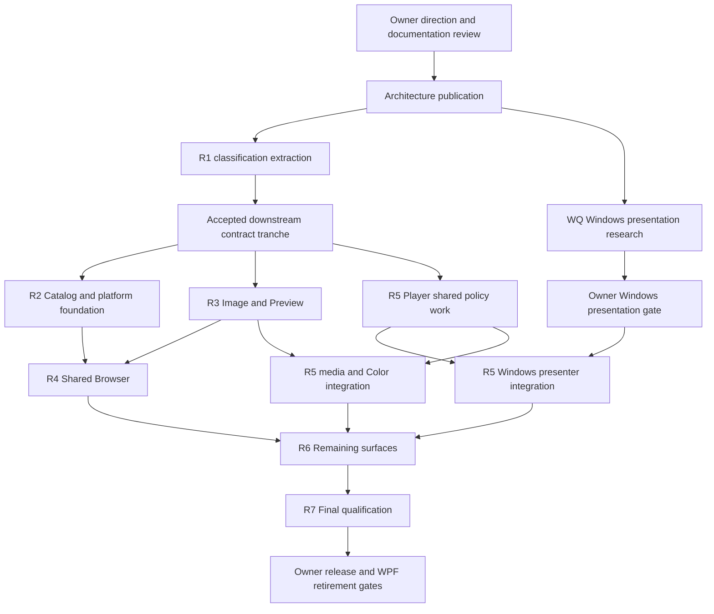

# Migration and qualification

## Status and gates

**PROPOSED — PENDING OWNER ACCEPTANCE:** R1–R7, WQ, exact contracts, estimates and schedules are planning, not authorized execution. Accepted architecture is recorded in [ADRs](../decisions/README.md); proof acceptance is indexed in [evidence](convergence-evidence.md). The owner authorized this documentation branch/Draft PR only; merge requires explicit acceptance.

Sequence: owner-selected direction → reviewed documentation publication/merge → separately approved issue scope and contract tranche → authorized slice → regression/package/owner acceptance → merge and owner-map update. This document is not a competing live roadmap or permission to create implementation issues. Epic #366 remains open; publication alone does not complete its release/migration DoD.

## R1: smallest useful production extraction

Purpose: execute the existing Browser rating, flag, flag-step and Color-label mutation path through neutral Domain/Application while the accepted WPF product remains shipping. R1 proves production delegation and an assembly boundary, not shared Avalonia or Mac product readiness.

| Existing boundary | Proposed treatment |
| --- | --- |
| [CatalogClassifications](../../LightflowStudio/CatalogClassifications.cs): `AssetFlag`, `AssetColorLabel`, `AssetClassification` | Move declarations to Domain |
| Same file: `AssetClassificationCommandPolicy`, `IAssetClassificationStore` | Move to Application; preserve semantics/signatures |
| Same file: `CatalogAssetClassificationStore` | Keep concrete SQL/session implementation in existing application |
| [BrowserActionPort.ClassifyAsync](../../LightflowStudio/MainWindow.BrowserActions.cs) mutation loop and typed argument mapping | Delegate to neutral classification service |
| Target validation and publication in the same port | Keep in WPF adapter |
| [CatalogMutationLifecycle](../../LightflowStudio/CatalogMutationLifecycle.cs) | Keep implementation; small neutral admission port delegates to it |
| [BrowserActions](../../Lightflow.Actions/BrowserActions.cs) | Preserve existing dispatcher/IDs/admission; no new registry |
| Classification consumers | Mechanical reference/import updates only |

Create only Domain, Application and neutral tests as required. Exact names/signatures/type visibility remain proposed. Application references Domain and existing Actions; Actions does not gain a Domain dependency for R1. No new SQLite/native/framework package in neutral projects. A service receives captured ordered AssetIds, existing typed action arguments, the store and logical-operation admission; it returns committed classifications without control/dispatcher/context objects.

Retain one outer Browser lifecycle admission, fresh-value per-asset mutation through the existing session gate, per-asset commits and current partial-failure behavior. No all-or-nothing batch transaction, extra lock or unsafe read/save fallback. Selection is captured before awaits. Rating assignment/menu toggle, clamped flags, preserved keywords, no-op revision behavior, stale-scope rejection and newest-revision publication stay unchanged. Projection/presentation changes within the same scope do not suppress fresh publication. Already admitted writes may complete after context replacement without publishing into the new scope. [Browser action authority](../BROWSER_ACTIONS.md) controls these details.

WPF retains Grid/Details/query/selection, scope construction, input ownership, context menus, Inspector invalidation, Player writers, Catalog storage/session/SQL, media and all views. Before coding, inventory declaration consumers, settle type visibility and admission adapter, preserve interaction-thread publication and record Windows baseline.

Acceptance:

1. Neutral projects build on Windows/Mac without Windows targeting packs or WPF/WinForms/Flyleaf/NAudio/SQLite/native resource references.
2. Production Browser calls the shared executor and removes its old mutation mapping; a neutral host exercises the same service contract.
3. Existing real-store tests preserve values/revisions/keywords, captured IDs, drain, stale context, concurrent writers and Smart membership.
4. No schema, storage, shortcut, dependency-version or visual behavior changes.
5. Required Windows tests, package checks and owner functional acceptance pass.

Retain [CatalogClassificationTests](../../LightflowStudio.Tests/CatalogClassificationTests.cs), [BrowserActionIntegrationTests](../../LightflowStudio.Tests/BrowserActionIntegrationTests.cs), [BrowserSemanticActionTests](../../LightflowStudio.Tests/BrowserSemanticActionTests.cs) and [CatalogMutationLifecycleTests](../../LightflowStudio.Tests/CatalogMutationLifecycleTests.cs). Neutral fake-store tests prove contract portability, not SQLite/product portability.

Exclude general Browser/Catalog/Player/UI extraction and feature redesign. Stop if a shell back-reference, concrete session/SQL in the neutral service, new lifecycle/dispatcher, changed commit/publication semantics or broad dependency extraction is required. Provisional unapproved effort: 2–3 engineer-weeks; expanded closure requires replan.

## WQ: early Windows presentation qualification

Separate bounded research, after publication and authorization, potentially alongside R1. It does not block classification extraction. Its accepted result gates production Windows Avalonia Player/presenter integration; do not defer it until that integration begins.

Question: can a compatible Windows GPU producer feed the pinned Avalonia render tree while preserving token/generation/Color identity, truthful UIAccepted, independent release, same-token capture, clipping/overlays/transforms/hit targets and resource loss/recreation? G1/G3 establish the Mac seam, not Windows import/fences, Flyleaf reuse, device compatibility or physical latency.

Proposed experiment: synthetic identity-marked GPU frames, no FFmpeg/audio/Catalog/production Player. Inspect supported public import APIs on the selected version, then exercise current/stale/rapid offers, Color revision, retained capture, delayed fences, overlays/input, resize/detach/rehost/resource loss and repeated teardown. Measure 1080p/4K cadence/copy/memory cost without equating it to physical latency.

Prerequisites: unchanged accepted contracts, pinned candidate runtime/compiler, qualified isolated Windows GPU host, task-owned roots and owner-agreed budget/performance thresholds. Pass requires exact accepted/captured identity, rejection of every deliberate stale case, no premature reuse/callback after invalidation, matching overlay hit targets and balanced resources through supported APIs. Numeric throughput/latency limits are still unapproved.

| Outcome | Next gate |
| --- | --- |
| Supported GPU path | Approve narrow adapter integration |
| Bounded GPU copy | Owner reviews measured cost before acceptance |
| CPU/readback only | Explicit reduced-performance fallback decision |
| Private APIs/framework fork or semantic failure | Stop; review maintenance/architecture alternatives |

Provisional unapproved effort: 1–2 engineer-weeks. Budget exhaustion produces evidence and a decision gate, not an automatic framework fork or backend rewrite.

## Proposed dependency graph

Arrows represent prerequisites; all execution boxes need separate authorization.

The contract tranche after R1 must separately settle storage roles/admission, owned pixels, selection/projection/anchors, Player identity/fences/errors and lifecycle/thread responsibility. R1 acceptance alone does not settle them.

## Proposed workstream roadmap

Effort includes focused implementation/verification. Every row is **provisional and unapproved**; envelopes must become bounded slices, not giant PRs.

| Package | Scope / shared versus platform | Acceptance and principal risk | Engineer-weeks |
| --- | --- | --- | ---: |
| Publication | Documentation/authority only | Owner review/merge; no implementation authority implied | 1–2 |
| WQ | Synthetic Windows presentation adapter research | Above correctness/cost gate; public API/device uncertainty | 1–2 |
| R1 | Shared classification models/executor; WPF adapter | Above Windows delegation/behavior gate; closure growth | 2–3 |
| R2 | Shared Catalog lifecycle/policy, resolved storage guards, transfer/remapping; OS volume/IPC/file adapters | Unsafe/unknown roles fail closed; identity/restore/transfer failure checks; path alias risk | 4–7 |
| R3 | Shared pixels/normalization/Preview; native gaps/display tagging | Two-platform corpus, EXIF/ICC/alpha/lifetime/stale publication; format parity risk | 3–5 |
| R4 | Shared shell, Browser Grid/retained Details, navigation/Collections/classification and required Settings subset; thin input/menu/AX | Same logical fixture/workflow on both packages, selection/anchors/bounded realization; control/AX cost | 7–12 |
| R5 | Shared Player policy/media orchestration; controlled Mac FFmpeg/Metal/CoreAudio and qualified Windows backend/presenter | Operation matrix, timing corpus, same-token capture/fences, recovery/soak and approved tolerances; native race risk | 16–28 |
| R6 | Remaining existing surfaces, Jobs/Export/file/dialog and compatibility workflows; narrow OS capabilities | Audited feature matrix without silent omissions; long-tail shell coupling | 6–10 |
| R7 | Final two-platform lifecycle/data/physical/accessibility/package qualification | Windows hands-on, arm64 sign/notary/upgrade/launch/recovery; hardware and release reliability | 4–7 |

Total: 44–76 engineer-weeks before contingency; approximately 55–99 with 25–30% planning contingency. R4 includes the 20–40 person-day Details estimate; do not add it again. R5 retains the uncertain 16–28 week proof envelope provisionally; WQ may change Windows scope. These are not approved budgets, release dates or unlimited execution allowances. Details' initial 1–3 days/month maintenance is also an unapproved research estimate, outside the one-time total.

Illustrative elapsed schedules only: one primary contributor at roughly 0.75 focused engineer-weeks/week plus gates → roughly 78–140 weeks; a coordinated three-contributor team averaging 1.8–2.2 across constrained lanes → roughly 36–64 weeks. Critical-path integration/hardware and 4–8 aggregate gate-wait weeks prevent linear speedup. No start date, staffing or release commitment is approved; changing scope or a failed WQ invalidates the illustration.

R4 is the earliest proposed useful shared-product milestone: one application/UI browses a logical Catalog and commits classifications on both platforms. It need not wait for all Player features. Packaging work starts early; R7 is final qualification, not first bundle creation.

## Windows continuity, compatibility and retirement

Keep the accepted WPF/Flyleaf Windows path shipping. Extract owners before replacing presentation; do not assume a WPF surface can enter Avalonia. Initially qualify a separately launched shared shell under the same normal single-owner policy; isolated test roots remain separate. In-process WPF/Avalonia embedding is not selected without a demonstrated need.

Each slice names the legacy method/service replaced, one new shared owner, retained compatibility adapter, regression evidence and retirement gate. Do not keep two behavior implementations after extraction. Preserve Catalog/Root/Asset IDs, settings/workspace/shortcut compatibility, mutation drain, Jobs interruption/recovery and conditional startup authority. Schema changes need separately reviewed migrations/backups. Binary rollback is valid only for compatible schemas; otherwise restore the protected prior Catalog. Never silently downgrade, raw-copy active WAL, or replace an unavailable Catalog with an empty one.

WPF retirement requires explicit Windows functional, visual, performance, package and hands-on acceptance. A Mac build or shared-unit pass cannot authorize it.

## Parallel lanes and critical path

After accepted contracts: independent storage adapters/transfer, image corpus/normalization, Details, media adapters and package infrastructure may progress in independent clones. Shared contract changes and shell/composition integration have one coordinated owner; no concurrent competing definitions of tokens, selection, admission, schema or action dispatch.

Critical path: documentation/contract gates → Player/presenter qualification/integration → full UI/product integration → packaged qualification. Storage/image/Details can overlap; contract uncertainty can move them onto the critical path. Exclusive native Mac GUI/audio/display execution must be reserved according to owner isolation policy. Windows WPF/native checks use the private desktop. Device/sleep/session/listening/display and signing work require scheduled hardware/trusted execution and owner acceptance where applicable.

## Validation, CI and packaging

Follow [AGENTS](../../AGENTS.md), [noninteractive validation](../noninteractive-validation.md) and [release plan](../RELEASE_PLAN.md). Current [CI](../../.github/workflows/ci-release.yml) is Windows-only; proof CI does not qualify Mac product support.

Proposed additions: neutral Windows/Mac builds and contract tests; real SQLite compatibility/recovery tests; generated media PTS/range/capture corpus; normalized image goldens; UI selection/focus/menu/anchor/virtualization checks; isolated native integration and package lifecycle checks. Owner qualification covers visual identity, accessibility/VoiceOver, audible/physical AV, data safety and performance against explicitly agreed limits.

For production slices, run Release tests via `scripts\Test-Noninteractive.ps1` and refresh the task-owned local Windows executable via `scripts\Build-Release.ps1 -Mode PullRequest -SkipInstaller` through the required private-desktop boundary. Supply exact executable/data-root paths and complete startup command; verify smoke/dependencies/timestamp/cleanup. Hosted CI is additional evidence, not a substitute.

Maintain Windows installer/portable distribution. Initial Mac is arm64 signed/notarized direct download; bundle identity, native payload/entitlements, signing topology, notarization/stapling and upgrade rules still need explicit design/qualification. Keep signing credentials in trusted release execution. Toolchain versions, minimum macOS/hardware and XAML generator pairing are not selected by proof versions or this roadmap.

## Deferred decisions and stop/replan register

| Risk/open decision | Gate |
| --- | --- |
| R1 dependency expansion or changed mutation/publication semantics | Stop extraction and review boundary |
| Windows import requires private APIs/fork or unacceptable copy cost | WQ owner gate before presenter integration |
| RenderTimer -6661 unexplained startup | Diagnose and qualify packaged launch/activation/lifecycle; no inferred cause |
| Audio -66681/no callbacks session-associated availability | Truthful unavailable/recovery; background/device/sleep checks; no universal lock-policy claim |
| Production token/callback/fence races | Concurrent stale/loss/capture/teardown contract qualification |
| Details headers/range/AX, VoiceOver and realistic-load cost | Approved control budget and two-platform tests; no silent TableView revert |
| Image goldens/calibrated display/ICC/HDR limits | Corpus and physical qualification; wider gamut requires separate scope |
| Unsafe roots and incomplete resolved-volume enforcement | G2 production guards and failure tests; no silent identity repair |
| Minimum OS/hardware, runtime/compiler, native isolation | Owner-supported matrix and execution policy |
| Numeric PTS/seek/AV/image/Browser limits | Owner acceptance before claiming pass |
| Broader permissive path migration, P1 physical SSD, active NAS/multi-writer | Deferred; separate architecture/product authorization |

Documentation does not approve new feature-specific persistence/workflows, budgets, autonomous delivery or AGENTS changes. Stop for new product semantics, contradictory accepted evidence, whole-view duplication, incompatible storage/frame guarantees or unacceptable qualified cost.
