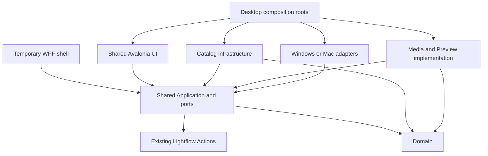

# Shared product boundaries

## Status and authority

**Accepted target direction; not implemented by this publication.** The owner selected one shared Windows/Apple Silicon Mac product and authorized architecture documentation on 2026-10-08. Exact project names, port signatures and extraction details below are **PROPOSED — PENDING OWNER ACCEPTANCE**. Publication does not authorize R1, WQ or later migration.

[Architecture map](../ARCHITECTURE.md), [ADRs](../decisions/README.md), [evidence](convergence-evidence.md) and [migration gates](migration-and-qualification.md) separate current production, accepted bounded research and future work. Existing feature/action contracts remain authoritative.

## Ownership and proposed project map

Create assemblies only as an authorized slice requires them. Names and the grouping of infrastructure/media projects are planning guidance, not a requirement to create every project immediately.

| Proposed boundary | Owns | Must not own |
| --- | --- | --- |
| `Lightflow.Domain` | Logical Catalog/Root/Asset identity, authored value models, ranges and Color intent | UI types, SQL, paths as asset identity, engines or native resources |
| Existing `Lightflow.Actions` | Typed semantic IDs/arguments/results, eligibility, targets, repeats, holds and shortcut conflicts | OS key codes, feature persistence, another keyboard architecture |
| `Lightflow.Application` | Shared workflows, Browser/navigation/selection, feature state, service orchestration and neutral ports | WPF/Avalonia controls, concrete SQLite/native engine resources |
| `Lightflow.Catalog` | Concrete SQLite repositories, migrations, mutation drain, backup/recovery | UI state, alternate durable identity, media-folder metadata sidecars |
| `Lightflow.Media` (possible further split) | Shared decoding/timing policy where portable, Preview demand/execution, normalized pixels and engine adapters | Separate per-OS Player feature rules or selection |
| `Lightflow.UI` | One Avalonia view/view-model/style implementation, retained Details, focus/input ownership and accessibility peers | SQL, authored mutation rules, native graphics/audio objects |
| Windows/Mac adapter projects | OS filesystem capabilities, GPU/audio output, native input translation, dialogs, activation and lifecycle | Independent feature workflows, Catalog identity or command semantics |
| Desktop composition roots | Implementation wiring, capability registration, startup/ownership and packaging | Competing feature policy |
| Existing WPF application | Temporary shipping presentation and compatibility adapters consuming extracted services | Copies of already extracted shared behavior |

Neutral ports belong with the application workflow they serve; avoid an unowned Common assembly. Concrete persistence and media implementations consume those contracts. A dedicated Avalonia presentation adapter may reference Avalonia and native graphics APIs, but native types remain behind it and out of shared feature UI. That adapter is not a whole-view fork.

## Target dependency direction

Arrows mean compile-time dependency. This is the proposed target, not the current solution. `Ports` is a logical part of Application, not a proposed extra assembly. Domain and Actions remain neutral; R1 does not add a Domain dependency to Actions.

Platform/framework interop dependencies stay within selected adapters and composition roots. Shared projects cannot depend back on a shell. A concrete infrastructure service must not pull WPF in through a convenience helper.

## Current-to-target ownership map

Paths identify existing production owners, not completed extractions.

| Existing source | Target treatment | Current limitation |
| --- | --- | --- |
| [Actions](../../Lightflow.Actions/BrowserActions.cs) and other action contracts | Retain semantic authority | UI/application ports still live in Windows assembly |
| [CatalogClassifications](../../LightflowStudio/CatalogClassifications.cs) | R1 models/contract/policy split; SQL remains initially | Mixed model/interface/SQLite implementation |
| [MainWindow.BrowserActions](../../LightflowStudio/MainWindow.BrowserActions.cs) | R1 classification execution delegates to shared service | Scope/input/publication remain WPF |
| [BrowserGrid](../../LightflowStudio/BrowserGrid.cs), [BrowserDetails](../../LightflowStudio/BrowserDetails.cs) | Later shared projection/selection plus presentation split | WPF converters coexist with reusable models |
| [WorkspaceContinuation](../../LightflowStudio/WorkspaceContinuation.cs) | Preserve semantic selection and visible anchors; audit paths | Uppercase folder normalization is not general portable identity |
| [MediaPlayback](../../LightflowStudio/MediaPlayback.cs), [service](../../LightflowStudio/MediaPlaybackService.cs), [coordinator](../../LightflowStudio/MediaPlaybackCoordinator.cs) | Preserve one-owner/generation intent; separate presenter contract | `FrameworkElement` crosses existing playback seam |
| [Flyleaf backend](../../LightflowStudio/FlyleafPlaybackBackend.cs), [audio](../../LightflowStudio/FfmpegAudioPlayback.cs) | Temporary Windows compatibility; qualified replacement | WPF/D3D video plus FFmpeg subprocess/WaveOut audio |
| [ThumbnailGeneration](../../LightflowStudio/ThumbnailGeneration.cs), [cached decoder](../../LightflowStudio/CachedPreviewImageConverter.cs) | Shared owned-pixel path and Preview policy | WIC/BitmapSource presentation |
| [Color processor](../../LightflowStudio/LightflowColorPostProcessor.cs), [DerivedFrameColor](../../LightflowStudio/DerivedFrameColor.cs) | Shared Color intent; D3D/Metal renderer adapters | GPU resources/shaders are Windows-specific |
| [Catalog lifecycle](../../LightflowStudio/CatalogDatabaseService.cs), [roots](../../LightflowStudio/MediaRoots.cs), [recovery](../../LightflowStudio/CatalogRecovery.cs) | Later extraction; retain transactions and identities | OS path/capability guards require accepted G2 follow-through |
| [ApplicationInstance](../../LightflowStudio/ApplicationInstance.cs) | Shared ownership intent; per-OS IPC/activation adapter | Windows mutex/pipe implementation |
| [Shared storage contracts](shared-storage-contracts-388.md), Domain facts and Application `StorageLocationPolicy` | R2-A neutral role suitability and revalidation, pending owner acceptance | Adapter consumption/enforcement remains #389/#390; current Windows startup/lifecycle unchanged |

## Shared application, state and UI

One workflow owns each feature's behavior. Browser Grid/Details share the ordered projection, query, selection and navigation; layout changes must not establish another Catalog query or identity model. Stable AssetId selection, primary/current identity and semantic visible anchors survive container recycling. Realized controls and Preview demand stay bounded by viewport/demand, with obsolete completion rejection. Existing scope, hidden-selection and range-anchor policies must be inspected rather than reinvented.

One shared Avalonia UI covers Browser, navigation/Collections, Inspector, Player controls/overlays, Settings, dialogs, menus and remaining product surfaces as they migrate. The accepted preferred Details direction is one shared custom retained-cell control. Stock TableView is not a silent fallback; reconsideration requires new evidence and owner review. Headers, range navigation, accessibility and realistic-thumbnail performance still require completion/qualification. The dark design vocabulary follows [DESIGN-SYSTEM](../DESIGN-SYSTEM.md); Mac typography and native menu conventions need explicit qualification.

Input uses local ownership, active semantic context, neutral shortcut resolution and existing command admission. Platform translation supplies logical gestures/capability data. Shared feature code must not use OS keyboard hooks or add its own dispatcher. Preserve [Browser actions](../BROWSER_ACTIONS.md), [Player actions](../PLAYER_ACTIONS.md) and [keyboard contracts](../KEYBOARD_SHORTCUTS.md), including Space, Left/Right, I/O/S/M, Ctrl+Left/Right and Alt+Left/Right meanings. Mac defaults require native convention acceptance; do not globally replace Ctrl with Command.

## Threading, resource and lifecycle responsibilities

These are boundary principles; exact interfaces remain proposed. Each future contract must specify thread affinity, cancellation, generation invalidation, ownership and error behavior.

- Shared services publish immutable semantic results. UI adapters marshal presentation updates to their framework dispatcher and recheck identity before publication.
- Decode/tempo/native output workers do not mutate controls. Realtime callbacks cannot acquire UI dependencies; allocation/locking behavior needs production qualification.
- Catalog owns complete logical-operation admission and drain. Extraction must not create a second writer gate or weaken existing nested-operation accounting.
- Presenter/native adapters own handles, GPU fences, audio devices and disposal. UIAccepted and release fencing remain separate; capture retains the accepted ready token.
- Shared shutdown policy coordinates Jobs interruption, Catalog drain/backup and cancellation. Platform adapters implement activation, Dock/file-open, quit/reopen, sleep/device/display events and native cleanup.
- Composition roots acquire application ownership before storage opens. WPF/Avalonia coexistence never authorizes a second normal Catalog writer. Test roots are isolated.

## Adapter capability families

| Family | Shared meaning | Platform responsibility |
| --- | --- | --- |
| Filesystem/storage | Logical identity, supported role, safe admission/containment | Resolved volume/mount/reparse locality and capabilities; explicit Unknown/Unavailable |
| File operations | Shared preflight, collision policy and requested operation | Trash/recycle capability, atomic replacement, process/file lifetime; no silent permanent-delete fallback |
| Dialog/clipboard/drag | Shared intent, targets and validated operation | Native chooser/payload/grant translation and lifetime |
| Presentation/audio | Accepted frame/clock semantics and recovery intent | GPU import/fences, output devices, display tagging, device-loss handling |
| Image formats | Common pixels/metadata/provenance | Narrow native format-gap decoder returning the common contract |
| Input/menu | Semantic commands, conflicts, holds and context | Logical native gesture translation and OS reservations |
| Lifecycle/package | Shared startup/quit/recovery intent and release evidence | OS activation/ownership, bundle/installer, native assets/signing |

Unknown capability does not silently become success. Capability differences must be deliberate, observable and owner-accepted.

## Enforcement and future feature parity

Before a future feature is accepted, identify one shared behavior owner, one shared UI owner, common behavioral tests and adapter-specific checks. Build the same shared assemblies for Windows and Mac; qualify both packages and document deliberate capability differences. No separate OS persistence model, feature service or whole view may appear unnoticed.

Proposed enforcement: project-reference checks, forbidden framework/native reference checks, neutral builds and adapter contract suites. Search hits alone are not sufficient evidence of dependency closure. Temporary WPF presentation delegates to shared behavior and has a retirement gate.

Review is required for reverse shell dependencies, native/UI types in domain/application contracts, whole-view forks, competing action/selection/Jobs owners, unsupported/private framework APIs, mandatory paid dependencies, new storage/concurrency semantics or weakened accepted frame/data guarantees.

## Architecture governance

GitHub issues define approved product/implementation scope; ADRs define accepted architecture decisions. Agents inspect applicable feature/action contracts and evidence before implementation. Exceptions require explicit review; code cannot silently redefine behavior. Each migration slice names replaced legacy behavior and its retirement gate. Update the implemented owner map after accepted slices; retain superseded ADRs and historical evidence with replacement links.

[AGENTS.md](../../AGENTS.md) continues to govern review, packaged acceptance and merging. The custom autonomous coordinator experiment is paused and separate from product development. Its runtime and coordination model are not dependencies of the Windows/Mac migration. Continue the established issue, independent full clone, validation, Draft PR and explicit owner acceptance process; no experimental coordinator policy is adopted here.
